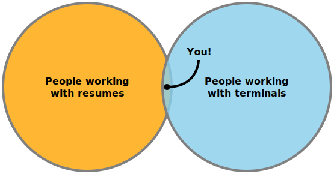

# ancv

Getting you [an CV](https://www.youtube.com/watch?v=mJUtMEJdvqM) (aka *[ANSI](https://en.wikipedia.org/wiki/ANSI_escape_code)-v*) straight to your terminal.

Be warned though, for this is kinda useless and just for fun:



## Getting started

1. Create a resume according to the [JSON Resume Schema](https://jsonresume.org/schema/) (see also the [schema specification](https://github.com/jsonresume/resume-schema/blob/master/schema.json)) either:

   - manually,
   - exporting from [LinkedIn](https://www.linkedin.com/) using [Joshua Tzucker's LinkedIn exporter](https://joshuatz.com/projects/web-stuff/linkedin-profile-to-json-resume-exporter/) ([repo](https://github.com/joshuatz/linkedin-to-jsonresume)), or
   - exporting from one of the platforms advertised as offering [JSON resume integration](https://jsonresume.org/schema/).
2. [Create a gist](https://gist.github.com/) named `resume.json` with those resume contents.
   See [here](https://gist.github.com/thomasdavis/c9dcfa1b37dec07fb2ee7f36d7278105) for a working example from a [JSON Resume co-founder](https://github.com/orgs/jsonresume/people).
3. Try it out, using...
   - curl:

      ```bash
      curl -L ancv.io/username
      ```

      `-L` is shorthand for [`--location`](https://curl.se/docs/manpage.html), allowing you to follow the redirect from `http://ancv.io` through to `https://ancv.io`.
      It's shorter than its also perfectly viable alternative:

      ```bash
      curl https://ancv.io/username
      ```

   - wget:

     ```bash
     wget -O - --quiet ancv.io/username
     ```

     where `-O` is short for [`--output-document`](https://linux.die.net/man/1/wget), used here to redirect to stdout.

   - PowerShell (5 and 7):

     ```powershell
     (iwr ancv.io/username).Content
     ```

     where `iwr` is an alias for [`Invoke-Webrequest`](https://docs.microsoft.com/en-us/powershell/module/microsoft.powershell.utility/invoke-webrequest?view=powershell-7.2), returning an object.

## Concept

(put this as an SVG flowchart, left to right with conceptual sketches)

Skeleton + Theme + Language + ASCII-mode toggle + Resume Data ==> terminal CV
