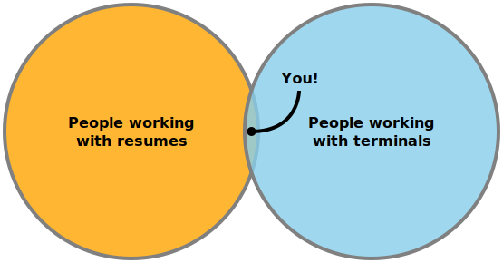

# ancv

Getting you [an CV](https://www.youtube.com/watch?v=mJUtMEJdvqM) (ANSI-v?) straight to your terminal.

Be warned though, this is entirely useless:



## Getting started

1. Create a resume according to the [JSON Resume Schema](https://jsonresume.org/schema/) ([schema specification](https://github.com/jsonresume/resume-schema/blob/master/schema.json)) either:

   - manually,
   - exporting from LinkedIn using [Joshua Tzucker's LinkedIn exporter](https://joshuatz.com/projects/web-stuff/linkedin-profile-to-json-resume-exporter/) ([repo](https://github.com/joshuatz/linkedin-to-jsonresume)), or
   - exporting from one of the platforms advertised as offering [JSON resume integration](https://jsonresume.org/schema/):
     - <https://gitconnected.com/portfolio-api>
     - <https://represent.io/>
     - <https://www.doyoubuzz.com/us/>
2. [Create a gist](https://gist.github.com/) named `resume.json` with those resume contents.
   See [here](https://gist.github.com/thomasdavis/c9dcfa1b37dec07fb2ee7f36d7278105) for a working example from a [JSON Resume co-founder](https://github.com/orgs/jsonresume/people).
3. Try it out!

   ```bash
   curl -L ancv.io/username
   ```

## Design

### Features

This being a hobby project, new (and old) features were tried out and used:

- fully async using [`aiohttp`](https://docs.aiohttp.org/en/stable/) and [gidgethub](https://gidgethub.readthedocs.io/en/latest/index.html)
- ~~[structural pattern matching](https://peps.python.org/pep-0634/), introduced in Python 3.10~~ Not used since [unsupported by AWS lambda](https://github.com/aws/aws-lambda-base-images/issues/31) (2022-07-16)
- [fully typed](https://mypy.readthedocs.io/en/stable/index.html) using Python type hints, verified through `mypy --strict` (with additional, [even stricter settings](pyproject.toml))
- [structural logging](https://github.com/hynek/structlog) with a JSON event stream output
- [`pydantic`](https://pydantic-docs.helpmanual.io/) for fully typed data validation (e.g., for APIs), facilitated by [automatic `pydantic` model generation](https://koxudaxi.github.io/datamodel-code-generator/) from e.g. OpenAPI specs like [GitHub's](https://github.com/github/rest-api-description/tree/main/descriptions/api.github.com) or [JSON Resume's](https://github.com/jsonresume/resume-schema/blob/master/schema.json), allowing full support from `mypy` and the IDE when using said validated data
- [12 Factor App](https://12factor.net/) conformance:
  1. [Codebase](https://12factor.net/codebase): [GitHub-hosted repo](https://github.com/alexpovel/ancv/)
  2. [Dependencies](https://12factor.net/dependencies): taken care of by [poetry](https://python-poetry.org/) and its standardized ([PEP 621](https://peps.python.org/pep-0621/)) [config](pyproject.toml) and [lock](poetry.lock) files, pinning all transient dependencies and providing virtual environments
  3. [Config](https://12factor.net/config): the app is configured using environment variables.
     Although [problematic](https://news.ycombinator.com/item?id=31200132), this approach was chosen for its simplicity
  4. [Backing Services](https://12factor.net/backing-services): not applicable for this very simple app
  5. [Build, release, run](https://12factor.net/build-release-run): handled through GitHub releases via git tags
  6. [Processes](https://12factor.net/processes): this simple app is stateless in and of itself
  7. [Port binding](https://12factor.net/port-binding): the `aiohttp` [server](ancv/web/server.py) part of the app acts as a [standalone web server](https://docs.aiohttp.org/en/stable/deployment.html#standalone), exposing a port.
     That port can then be serviced by any arbitrary reverse proxy
  8. [Concurrency](https://12factor.net/concurrency): covered by async functionality (in a single process and thread).
     This being a stateless app, horizontal scaling through additional processes is trivial (e.g. via serverless hosting), although vertical scaling will likely suffice indefinitely
  9. [Disposability](https://12factor.net/disposability): `aiohttp` handles `SIGTERM` gracefully
  10. [Dev/prod parity](https://12factor.net/dev-prod-parity): trivial to do for this simple app.
       If running on Windows, mind [this issue](https://stackoverflow.com/q/45600579/11477374).
       If running on Linux, no special precautions are necessary
  11. [Logs](https://12factor.net/logs): structural JSON logs are written directly to `stdout`
  12. [Admin processes](https://12factor.net/admin-processes): not applicable either

## Concept

(put this as an SVG flowchart, left to right with conceptual sketches)

Skeleton + Theme + Language + ASCII-mode toggle + Resume Data ==> terminal CV

## Contributing

Set up your environment:

1. [Install `poetry`](https://python-poetry.org/docs/master/#installing-with-the-official-installer)
2. Run `poetry install`
3. Enter into the created environment with `poetry shell`
4. Set up `git` hooks provided by [`pre-commit`](https://pre-commit.com/#intro): `make hooks`

## Other solutions

Very hard to find any, and even hard to google.
For example, `bash curl curriculum vitae` will prompt Google to interpret `curriculum vitae == resume`, which isn't wrong but `curl resume` is an entirely unrelated query (concerned with resuming halted downloads and such).

- <https://github.com/soulshake/cv.soulshake.net>

Related, but 'fake' hits:

- <https://ostechnix.com/create-beautiful-resumes-commandline-linux/>
