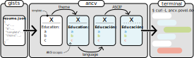

# [ancv](https://github.com/alexpovel/ancv)

Getting you [an CV](https://youtu.be/mJUtMEJdvqM?t=16) (*[ANSI](https://en.wikipedia.org/wiki/ANSI_escape_code)-v* 🤡) straight to your and anyone else's terminals.

Be warned though, for this is kinda useless and just for fun:


## Getting started

1. Create your resume according to the [JSON Resume Schema](https://jsonresume.org/schema/) (see also the [schema specification](https://github.com/jsonresume/resume-schema/blob/master/schema.json)) either:

   - manually (see [the `heyho` sample](./ancv/data/showcase.resume.json) for a possible starting point),
   - exporting from [LinkedIn](https://www.linkedin.com/) using [Joshua Tzucker's LinkedIn exporter](https://joshuatz.com/projects/web-stuff/linkedin-profile-to-json-resume-exporter/) ([repo](https://github.com/joshuatz/linkedin-to-jsonresume)), or
   - exporting from one of the platforms advertised as offering [JSON resume integration](https://jsonresume.org/schema/).
2. [Create a **public** gist](https://gist.github.com/) named `resume.json` with your resume contents.
3. You're now the proud owner of an ancv.
   Time to try it out.

   The following examples work out-of-the-box.
   **Replace `heyho` with your GitHub username** once you're all set up.

   - curl:

      ```bash
      curl -L ancv.io/heyho
      ```

      with `-L` being shorthand for [`--location`](https://curl.se/docs/manpage.html), allowing you to follow the redirect from `http://ancv.io` through to `https://ancv.io`.
      It's shorter than its also perfectly viable alternative:

      ```bash
      curl https://ancv.io/heyho
      ```

      Lastly, you might want to page the output for easiest reading, top-to-bottom:

      ```bash
      curl -sL ancv.io/heyho | less
      ```

      If that garbles the rendered output, try `less -r` aka [`--raw-control-chars`](https://man7.org/linux/man-pages/man1/less.1.html).

   - wget:

     ```bash
     wget -O - --quiet ancv.io/heyho
     ```

     where `-O` is short for [`--output-document`](https://linux.die.net/man/1/wget), used here to redirect to stdout.

   - PowerShell (5 and 7):

     ```powershell
     (iwr ancv.io/heyho).Content
     ```

     where `iwr` is an alias for [`Invoke-Webrequest`](https://docs.microsoft.com/en-us/powershell/module/microsoft.powershell.utility/invoke-webrequest?view=powershell-7.2), returning an object.

## Configuration

*All configuration is optional.*

The CV is constructed as follows:



These components may be controlled using the `ancv` field in your `resume.json`:

```json
{
   "basics": {},
   "education": [],
   "meta": {
     "ancv": {
        "template": "Sequential",
        "theme": "basic",
        "ascii_only": false,
        "language": "en"
     }
   }
}
```

The shown values are the default ones.
All fields, including the `ancv` one itself, are optional, and the above defaults will be set for omitted fields.
This means **a [valid JSON resume](https://github.com/jsonresume/resume-schema/blob/master/schema.json) (without an `ancv` section) is also valid here**.
The currently available options can be printed out:

```bash
$ pip install ancv >> /dev/null && ancv list
Components
├── Templates
│   └── Sequential
├── Themes
│   ├── plain
│   └── basic
└── Translations
    ├── en
    └── de
```

## Installation

### As a library

Install the package as usual:

```bash
pip install ancv
```

This also allows you to import whatever you could want or need from the package, if anything.
Note that it's pretty heavy on the dependencies.

### As a container

See also the available [packages aka images](https://github.com/alexpovel/ancv/pkgs/container/ancv):

```bash
docker pull ghcr.io/alexpovel/ancv
```

Versioned tags (so you can pin a major) are available.

### Local usage

Once installed, you could for example check whether your `resume.json` is valid at all (`validate`) or get a glimpse at the final product (`render`):

```bash
# pip route:
$ ancv render resume.json
# container route:
$ docker run -v $(pwd)/resume.json:/app/resume.json ghcr.io/alexpovel/ancv render
```

## Self-hosting

Self-hosting is a first-class citizen here.

### Context: Cloud Hosting

The <https://ancv.io> site is hosted on [Google Cloud Run](https://cloud.google.com/run) (serverless) and deployed there [automatically](https://github.com/alexpovel/ancv/runs/8172131447), such that the latest release you see here is also the code executing in that cloud environment.
That's convenient to get started: simply create a `resume.json` gist and you're good to go within minutes.
It can also be used for debugging and playing around; it's a playground of sorts.

You're invited to use this service for as much and as long as you'd like.
However, obviously, as an individual I cannot guarantee its availability in perpetuity.
You might also feel uncomfortable uploading your CV onto GitHub, since it *has* to be public for this whole exercise to work.
Lastly, you might also be suspicious of me inserting funny business into your CV before serving it out.
If this is you, self-hosting is for you.

### Setup

For simplicity, using Docker Compose (with Docker's recent [Compose CLI plugin](https://docs.docker.com/compose/install/compose-plugin/)):

1. Clone this repository onto your server (or fork it, make your edits and clone that)
2. `cd self-hosting`
3. Edit [Caddy's config file](./self-hosting/Caddyfile) ([more info](https://caddyserver.com/docs/caddyfile)) to contain your own domain name
4. Place your `resume.json` into the directory
5. Run `docker compose up`

Caddy (chosen here for simplicity) will handle HTTPS automatically for you, but will of course require domain names to be set up correctly to answer ACME challenges.
Handling DNS is up to you; for dynamic DNS, I can recommend [`qmcgaw/ddns-updater`](https://github.com/qdm12/ddns-updater).

If you self-host in the cloud, the server infrastructure might be taken care of for you by your provider already (as is the case for Google Cloud Run).
In these cases, a dedicated proxy is unnecessary and a single [Dockerfile](./Dockerfile) might suffice (adjusted to your needs).
True [serverless](https://www.serverless.com/) is also a possibility and an excellent fit here.
For example, one could use [Digital Ocean's *Functions*](https://docs.digitalocean.com/products/functions/).
If you go that route and succeed, please let me know! (I had given up with how depressingly hard dependency management was, as opposed to tried-and-tested container images.)

---

<p align="center">
   <a href="https://github.com/alexpovel/ancv">
     
   </a>
</p>
