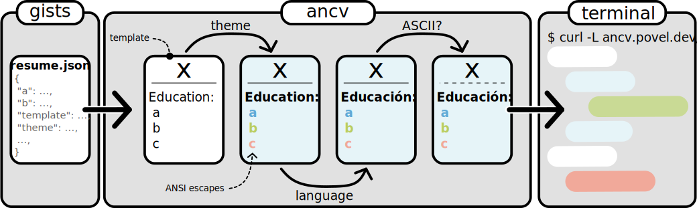

# [ancv](https://github.com/alexpovel/ancv)

Getting you [an CV](https://www.youtube.com/watch?v=mJUtMEJdvqM) (*[ANSI](https://en.wikipedia.org/wiki/ANSI_escape_code)-v* 🤡) straight to your and anyone else's terminals.

Be warned though, for this is kinda useless and just for fun:


## Getting started

1. Create a resume according to the [JSON Resume Schema](https://jsonresume.org/schema/) (see also the [schema specification](https://github.com/jsonresume/resume-schema/blob/master/schema.json)) either:

   - manually (see [this sample](./tests/test_data/resumes/full.json) for a possible starting point),
   - exporting from [LinkedIn](https://www.linkedin.com/) using [Joshua Tzucker's LinkedIn exporter](https://joshuatz.com/projects/web-stuff/linkedin-profile-to-json-resume-exporter/) ([repo](https://github.com/joshuatz/linkedin-to-jsonresume)), or
   - exporting from one of the platforms advertised as offering [JSON resume integration](https://jsonresume.org/schema/).
2. [Create a **public** gist](https://gist.github.com/) named `resume.json` with those resume contents.
   See [here](https://gist.github.com/alexpovel/4a94aaccdc6ed8d214d0f8a73e50a536) for a working example from the author.
3. Try it out, using...
   - curl:

      ```bash
      curl -L ancv.io/username
      ```

      with `-L` being shorthand for [`--location`](https://curl.se/docs/manpage.html), allowing you to follow the redirect from `http://ancv.io` through to `https://ancv.io`.
      It's shorter than its also perfectly viable alternative:

      ```bash
      curl https://ancv.io/username
      ```

      Lastly, you might want to page the output for easiest reading, top-to-bottom:

      ```bash
      curl -sL ancv.io/username | less
      ```

   - wget:

     ```bash
     wget -O - --quiet ancv.io/username
     ```

     where `-O` is short for [`--output-document`](https://linux.die.net/man/1/wget), used here to redirect to stdout.

   - PowerShell (5 and 7):

     ```powershell
     (iwr ancv.io/username).Content
     ```

     where `iwr` is an alias for [`Invoke-Webrequest`](https://docs.microsoft.com/en-us/powershell/module/microsoft.powershell.utility/invoke-webrequest?view=powershell-7.2), returning an object.

   **For a quick, working example replace `username` with `alexpovel`.**

## Configuration

*All configuration is optional.*

The CV is constructed as follows:



These components may be controlled using the `ancv` field in your `resume.json`:

```json
{
   "basics": {},
   "education": [],
   "meta": {
     "ancv": {
        "template": "Sequential",
        "theme": "basic",
        "ascii_only": false,
        "language": "en"
     }
   }
}
```

The shown values are the default ones.
All fields, including the `ancv` one itself, are optional, and the above defaults will be set for omitted fields.
This means **a [valid JSON resume](https://github.com/jsonresume/resume-schema/blob/master/schema.json) (without an `ancv` section) is also valid here**.
The currently available options can be printed out:

```bash
$ pip install ancv >> /dev/null && ancv list
Components
├── Templates
│   └── Sequential
├── Themes
│   ├── plain
│   └── basic
└── Translations
    ├── en
    └── de
```

## Installation as a library

For local use, install the package as usual.
Note that it's pretty heavy on the dependencies.

```bash
pip install ancv
```
---

<p align="center">
   <a href="https://github.com/alexpovel/ancv">
     
   </a>
</p>
